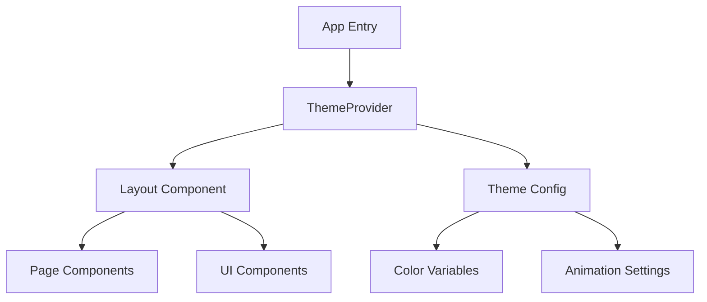

## 产品概述

针对SkinLab应用进行面向女性用户的浪漫风格UI/UX优化，通过柔和的色彩搭配和精致的视觉元素，打造温柔、优雅且极具浪漫美感的用户界面体验。

## 核心功能

- **浪漫主题切换**：提供浪漫风格主题配置，支持粉色、淡紫、白色与浅金色的色调组合
- **视觉元素优化**：界面中融入花朵、爱心等浪漫装饰元素，提升氛围感
- **色彩系统重构**：建立基于粉紫色系的完整色彩规范，确保视觉协调舒适
- **组件样式升级**：统一按钮、卡片、导航栏等UI组件的圆角、阴影和渐变效果，体现柔和质感
- **交互微动效**：添加细腻的过渡动画和悬停反馈，增强优雅的交互体验
- **响应式适配**：确保在桌面和移动端均能呈现完美的浪漫视觉效果

## 技术栈

- **前端框架**: React (TypeScript)
- **样式方案**: Tailwind CSS
- **组件库**: shadcn/ui
- **图标库**: Lucide React
- **动画库**: Framer Motion
- **状态管理**: React Context API

## 架构设计

### 系统架构

采用组件化架构，将主题配置抽离至全局Context，通过CSS Variables实现动态主题切换。



### 模块划分

- **ThemeContext**: 管理全局主题状态、颜色变量和配置切换逻辑
- **UI Components**: 包含Button, Card, Input等基础组件的浪漫风格重写
- **Decorative Elements**: 独立的装饰性组件（花朵、爱心背景等）
- **Layout**: 主布局容器，统一管理页面结构和导航

### 数据流

用户交互触发主题切换 -> ThemeContext更新状态 -> CSS Variables变更 -> 组件样式响应更新。

### 目录结构

```
src/
├── components/
│   ├── ui/              # shadcn组件及样式覆盖
│   ├── layout/          # 布局组件
│   └── decorative/      # 装饰元素组件
├── context/
│   └── ThemeContext.tsx # 主题上下文
├── styles/
│   ├── globals.css      # 全局样式与CSS变量
│   └── theme.css        # 浪漫主题样式
└── lib/
    └── utils.ts         # 工具函数
```

### 核心代码结构

- **ThemeContext**: 提供`useTheme` Hook，包含`primaryColor`, `secondaryColor`, `accentColor`等状态。
- **CSS Variables**: 定义`--color-primary`, `--color-secondary`, `--radius-md`, `--shadow-soft`等变量。
- **Component Props**: 扩展shadcn组件属性，增加`variant="romantic"`等变体。

### 技术实现计划

1. **色彩系统定义**: 使用CSS Variables定义粉色、紫色、金色色板。
2. **装饰元素开发**: 使用SVG或CSS绘制低透明度的花朵、爱心背景。
3. **组件样式覆盖**: 利用Tailwind的`@layer`机制覆盖shadcn默认样式，增加圆角和柔和阴影。
4. **动效集成**: 使用Framer Motion为页面切换和卡片悬停添加弹性或淡入淡出效果。

### 集成点

- React Context与Tailwind Config集成，实现动态颜色注入。
- Framer Motion与React组件生命周期结合，处理挂载与卸载动画。

## 设计风格

采用**浪漫唯美主义**风格，结合**Glassmorphism（毛玻璃拟态）**与**柔和渐变**。整体视觉以低饱和度的粉紫色系为主，营造梦幻、温柔的女性化氛围。界面大量使用圆角卡片、细腻阴影和微光效果，点缀抽象花朵与爱心线条，保持画面的通透与优雅。

### 页面规划

1. **首页**

- 顶部导航：半透明毛玻璃效果，Logo配金色描边。
- Hero区域：柔和粉紫渐变背景，漂浮的装饰性花朵粒子，主标题使用优雅衬线体。
- 功能入口：大圆角卡片展示，悬停时轻微上浮并散发微光。
- 底部信息：极简 Footer，配爱心图标装饰。

2. **产品详情页**

- 图片展示：大尺寸圆角图片，边框带淡淡的金色光晕。
- 信息卡片：白色半透明卡片，悬浮于花朵背景之上，内容层级分明。
- 操作按钮：渐变粉色主按钮，点击时产生波纹扩散效果。

3. **个人中心**

- 头像区域：圆形头像框，外围环绕动态光圈。
- 菜单列表：卡片式列表项，右侧箭头使用金色。
- 装饰背景：角落处有若隐若现的插画元素。

### 单页面块设计

- **Hero Banner Block**: 全宽背景，渐变色，包含主标题、副标题和CTA按钮，背景叠加低透明度花朵SVG。
- **Feature Grid Block**: 网格布局，每个单元为圆角卡片，图标居中，标题下划线装饰。
- **Product Card Block**: 图片占上部分，文字信息占下部分，收藏按钮为爱心形状，点击变色。
- **Navigation Bar Block**: 固定顶部，背景模糊，左侧Logo，右侧链接，搜索框带圆角和柔和阴影。

### 交互细节

- 按钮悬停：颜色加深，边缘泛起柔光。
- 页面切换：内容淡入，装饰元素轻微位移。
- 滚动效果：元素视差滚动，增加层次感。