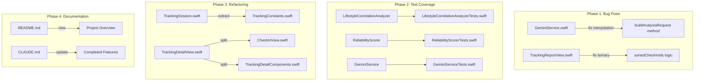

# Epic: Code Quality, Test Coverage & Technical Debt

## Executive Summary

基于 RepoPrompt context-scout 深度分析，发现 SkinLab 项目存在以下关键问题需要解决：
- **Critical Bugs**: GeminiService 字符串插值错误导致 API 调用失败
- **Test Coverage**: 目标 60%，当前核心服务缺乏单元测试
- **Code Quality**: 大文件需要拆分，硬编码常量需要集中管理
- **Documentation**: 缺少 README.md，CLAUDE.md 未更新 fn-2/fn-3 完成的功能

## Overview

### Problem Statement

1. **GeminiService 存在 critical bug**: `buildAnalysisRequest` 方法使用 `(` 而非 `\(` 进行字符串插值，导致 API URL 构建错误
2. **测试覆盖不足**: LifestyleCorrelationAnalyzer、ReliabilityScorer、GeminiService 等核心服务没有单元测试
3. **代码组织问题**: TrackingDetailView.swift 有 927 行，check-in 天数常量在多个文件中重复
4. **文档不完整**: 缺少 README.md，CLAUDE.md 未记录 fn-2/fn-3 完成的功能

### Goals

- 修复所有 critical bugs，确保 API 调用正常
- 达到 60% 测试覆盖率目标
- 改善代码可维护性和一致性
- 更新文档反映当前项目状态

## Scope

### In Scope

- Bug 修复 (GeminiService, TrackingReportView)
- 核心服务单元测试 (3 个 test files + 1 个 mock 文件)
- 代码重构 (常量提取, 大文件拆分)
- 文档更新 (README.md, CLAUDE.md)

### Out of Scope

- 新功能开发 (Freeze UI, Analytics integration)
- @Observable 迁移 (独立 epic)
- TipKit/App Intents 集成 (独立 epic)
- Accessibility 全面审计 (独立 epic)
- UI 语言一致性 (需要独立 epic 进行全面审计)

## Phases

### Phase 1: Critical Bug Fixes (P0)
修复影响核心功能的 bugs

### Phase 2: Test Infrastructure (P1)
建立测试基础设施，添加核心服务测试

### Phase 3: Code Refactoring (P2)
提取常量，拆分大文件

### Phase 4: Documentation (P3)
更新项目文档

## Architecture Impact



## Alternatives Considered

### Bug Fixes
- **Option A (Chosen)**: 直接修复字符串插值
- **Option B (Rejected)**: 重写整个 GeminiService - 过度工程化

### Test Coverage
- **Option A (Chosen)**: 优先测试核心业务逻辑服务
- **Option B (Rejected)**: 优先测试 ViewModels - 依赖更多，ROI 更低

### Code Refactoring
- **Option A (Chosen)**: 提取常量 + 拆分大文件
- **Option B (Rejected)**: 完全重构为 Clean Architecture layers - 范围过大

## Non-Functional Targets

| Metric | Current | Target | Note |
|--------|---------|--------|------|
| Test Coverage | <30% estimated | 60% (non-blocking) | 本 epic 添加关键测试，覆盖率追踪在后续 epic |
| TrackingDetailView Lines | 927 | 600 | 本 epic 目标文件 |
| Duplicated Constants | 4+ files | 1 file | |
| Critical Bugs | 2 | 0 | |

**测试覆盖率验收方式**: 本 epic 不阻塞于达到 60%，验收标准是"新增的 3 个测试文件全部通过 + 现有测试无回归"。60% 覆盖率目标将在后续独立 epic 追踪，届时使用 `xcodebuild test -enableCodeCoverage YES` + `xcrun xccov view --report` 验证。

## Rollout Plan

1. **Phase 1**: 在独立分支上修复 bugs，运行现有测试
2. **Phase 2**: 添加测试，确保不破坏现有功能
3. **Phase 3**: 重构后运行全部测试验证
4. **Phase 4**: 文档更新与代码变更同步

## Rollback Strategy

- 每个 Task 单独提交，可以独立 revert
- Phase 1 bug fixes 如果导致回归，直接 revert 相关 commit
- Phase 2-3 如果引入问题，可以 cherry-pick 回滚

## Risks & Mitigations

| Risk | Probability | Impact | Mitigation |
|------|------------|--------|------------|
| Bug fix 引入新问题 | Low | High | 运行全部现有测试 + 手动验证 API 调用 |
| 重构破坏 UI | Medium | Medium | 拆分后运行 UI 测试 + 视觉检查 |
| 测试用例遗漏边缘情况 | Medium | Low | 使用 gap analysis 中识别的边缘情况 |
| 文档与代码不同步 | Low | Low | 在同一 PR 中更新文档和代码 |

## Success Metrics

- [ ] GeminiService 字符串插值修复验证：`buildAnalysisRequest` 单测覆盖 endpoint/header/body 构建；手动冒烟测试 AI 分析功能正常并记录
- [ ] 新增的 3 个测试文件全部通过（LifestyleCorrelationAnalyzerTests, ReliabilityScorerTests, GeminiServiceTests）
- [ ] `TrackingDetailView.swift` < 600 行（本 epic 目标文件）
- [ ] check-in 天数常量集中在 1 个文件
- [ ] README.md 存在且完整

## Quick Commands

```bash
# Run all tests
xcodebuild test -scheme SkinLab -destination 'platform=iOS Simulator,name=iPhone 15'

# Check test coverage (for future coverage tracking epic)
# xcodebuild test -scheme SkinLab -destination 'platform=iOS Simulator,name=iPhone 15' -enableCodeCoverage YES
# xcrun xccov view --report DerivedData/SkinLab/Logs/Test/*.xcresult

# Verify TrackingDetailView.swift < 600 lines (本 epic 目标文件)
wc -l SkinLab/Features/Tracking/Views/TrackingDetailView.swift

# Verify no remaining hardcoded checkInDays
grep -r "\[0, 7, 14, 21, 28\]" SkinLab/Features/Tracking --include="*.swift"
```

## Acceptance Criteria

### Must Have
- [ ] GeminiService `buildAnalysisRequest` 方法使用正确的 `\(` 插值
- [ ] TrackingReportView `sortedCheckInIds` 逻辑修复，使用 `timelineReliable` 当不为空时
- [ ] LifestyleCorrelationAnalyzerTests.swift 存在且通过
- [ ] ReliabilityScorerTests.swift 存在且通过
- [ ] GeminiServiceTests.swift 存在且通过
- [ ] TrackingConstants.swift 包含 `checkInDays` 常量
- [ ] 所有 Tracking 目录下的 `[0, 7, 14, 21, 28]` 字面量被替换
- [ ] README.md 存在且包含项目概述
- [ ] 新文件已添加到 Xcode 项目对应 target

### Should Have
- [ ] TrackingDetailView.swift < 600 行
- [ ] CLAUDE.md 更新 fn-2/fn-3 完成功能（在 FLOW-NEXT 标记上方）

### Nice to Have
- [ ] AnalysisViewModelTests.swift

## References

### Key Files
- `SkinLab/Core/Network/GeminiService.swift` - Bug in `buildAnalysisRequest` method
- `SkinLab/Features/Tracking/Views/TrackingReportView.swift` - Bug in `sortedCheckInIds` logic
- `SkinLab/Features/Tracking/Views/TrackingDetailView.swift` - 927 lines, needs split
- `SkinLab/Features/Tracking/Models/TrackingSession.swift` - Has hardcoded checkInDays

### Research Sources
- context-scout analysis (2026-01-22)
- practice-scout: iOS 17+ best practices
- docs-gap-scout: Documentation gaps
- flow-gap-analyst: Edge cases and questions
