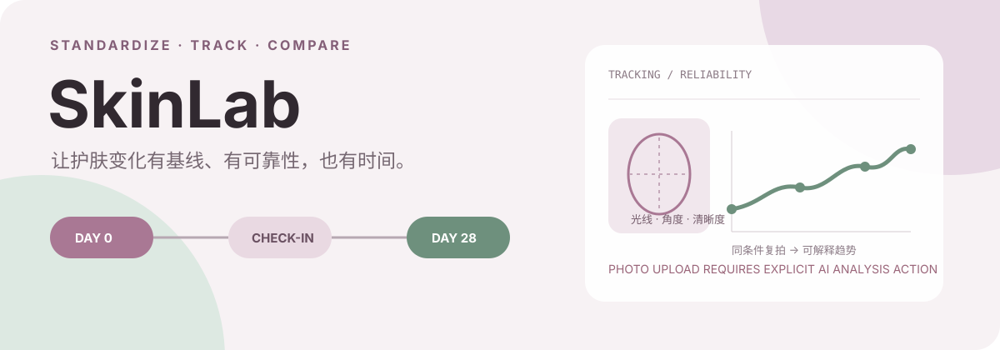

<p align="center">
  
</p>

**SkinLab** 是一款 iOS 17+ 的皮肤记录与护肤效果追踪应用。它把一次 AI 照片分析变成可重复的基线：标准化拍摄、记录产品与生活方式、按周期复拍，再用可靠性与趋势模型解释变化。

> **隐私与医疗边界：** AI 分析不是离线完成。点击分析后，压缩后的面部照片会以 base64 JPEG 发送到 OpenRouter 的 chat-completions API，当前模型为 `google/gemini-3-flash-preview`。结果只供护肤记录参考，不构成医疗诊断；异常皮肤问题应咨询专业医护人员。

## 从照片到证据

```text
标准化拍照
  → 质量 / 可靠性检查
  → OpenRouter + Gemini vision 分析
  → SwiftData 保存结果与基线
  → 复拍 + 产品 / 生活方式记录
  → 趋势、异常、季节性与相关性提示
```

仓库中的真实功能模块：

| 模块 | 当前源码 |
|---|---|
| Analysis | 相机/相册、图片优化、OpenRouter 请求、皮肤与区域分数、routine generation |
| Tracking | 28 天 session、check-in、可靠性、time series、异常/季节性/forecast、产品归因 |
| Products | 本地产品/成分数据、OCR、风险规则与 AI insight |
| Engagement | 连续记录、streak freeze、achievement、提醒与庆祝动画 |
| Community | consent level、匿名 profile、skin twin matching、反馈与推荐 engine |
| Privacy | 本地存储开关、照片保留/删除、数据导出与全量删除入口 |

这些是源码能力，不代表 App Store 已发布或临床验证。

## 快速开始

要求：

- macOS + Xcode **15.2**（CI 固定版本）
- iOS **17.0+** simulator 或设备
- OpenRouter API key

```bash
git clone <repository-url>
cd SkinLab
open SkinLab.xcodeproj
```

在 Xcode 中选择 `SkinLab` scheme 与 iOS 17 simulator。开发运行时，在 **Product → Scheme → Edit Scheme → Run → Arguments → Environment Variables** 添加：

```text
OPENROUTER_API_KEY=<your-key>
```

然后 Build & Run。`GeminiService` 会先读取进程环境变量，再读取 Info.plist 中由 build setting 展开的 `OPENROUTER_API_KEY`。

仓库保留了 `Secrets.xcconfig.template`，但当前 `project.pbxproj` 没有把 `Secrets.xcconfig` 设为 base configuration；**仅复制模板不会自动注入 key**。若需要 archive，应在 Xcode build settings/CI secret 中显式提供该值，且不要提交 key。

命令行构建：

```bash
xcodebuild build \
  -project SkinLab.xcodeproj \
  -scheme SkinLab \
  -destination 'platform=iOS Simulator,name=iPhone 15' \
  CODE_SIGNING_ALLOWED=NO \
  OPENROUTER_API_KEY='<your-key>'
```

## 第一次使用

1. 允许相机或相册权限。
2. 按拍摄引导保持光线、角度与清晰度，创建一次分析。
3. 在分析结果中查看分区与问题维度；不要把分数视为医学结论。
4. 从分析结果建立 tracking baseline，并只填写真实使用的产品/生活方式信息。
5. 后续 check-in 尽量复用相同拍摄条件，再查看可靠性与趋势，而不是比较任意两张照片。
6. 在 Profile → Privacy Center 检查 consent、照片保留、导出和删除选项。

### 重要隐私事实

- SwiftData 保存分析、追踪、产品与 profile records。
- 原图是否在设备侧保留由 Privacy Center 选项控制。
- **AI 请求仍会把压缩图发送给 OpenRouter**；“本地优先”不等于 vision inference 完全离线。
- 社区匹配使用 consent level 与匿名 profile 模型，但使用前仍应审查具体数据流与部署配置。

## 工程结构

```text
SkinLab/
├── App/                 应用入口、恢复视图与主导航
├── Core/                config、network、camera、OCR、cache、errors
├── Features/
│   ├── Analysis/        拍照、AI 分析、结果与 routine
│   ├── Tracking/        session、check-in、趋势与报告
│   ├── Products/        成分与产品
│   ├── Community/       consent、matching、feedback
│   ├── Engagement/      streak 与 achievements
│   ├── Profile/         用户资料与 Privacy Center
│   └── Scenario/        场景化护肤建议
├── Services/            analytics / funnel events
└── UI/                  theme 与共享组件
```

架构为 SwiftUI + MVVM/Clean Architecture，持久化使用 SwiftData，图片预处理使用 UIKit/Vision 相关能力。

## 测试与质量

```bash
xcodebuild test \
  -project SkinLab.xcodeproj \
  -scheme SkinLab \
  -destination 'platform=iOS Simulator,name=iPhone 15' \
  CODE_SIGNING_ALLOWED=NO \
  OPENROUTER_API_KEY='CI_PLACEHOLDER_KEY'
```

仓库还提供：

```bash
make help
make lint
make format-check
make test
make test-ui
make quality-quick
```

测试覆盖 Analysis、Tracking、Community、Products、Engagement、Network、Profile、Scenario、Weather 与 UI flows。可用 simulator 名称随本机 Xcode runtime 变化；必要时先运行 `xcrun simctl list devices available`。

## 进一步阅读

- [`docs/ARCHITECTURE.md`](./docs/ARCHITECTURE.md) — 工程架构
- [`docs/TESTING.md`](./docs/TESTING.md) — 测试策略
- [`SkinLab/SKIN_TWIN_MATCHING_SYSTEM_DESIGN.md`](./SkinLab/SKIN_TWIN_MATCHING_SYSTEM_DESIGN.md) — matching 设计
- [`DATA_COLLECTION_README.md`](./DATA_COLLECTION_README.md) — 成分/产品数据处理

仓库当前没有根 License 文件；分发与商用前请先补充明确授权。
