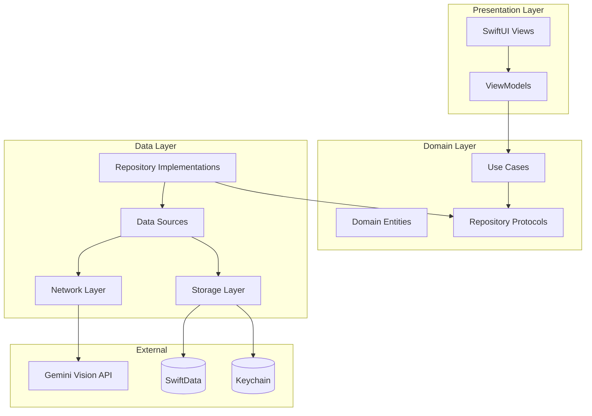
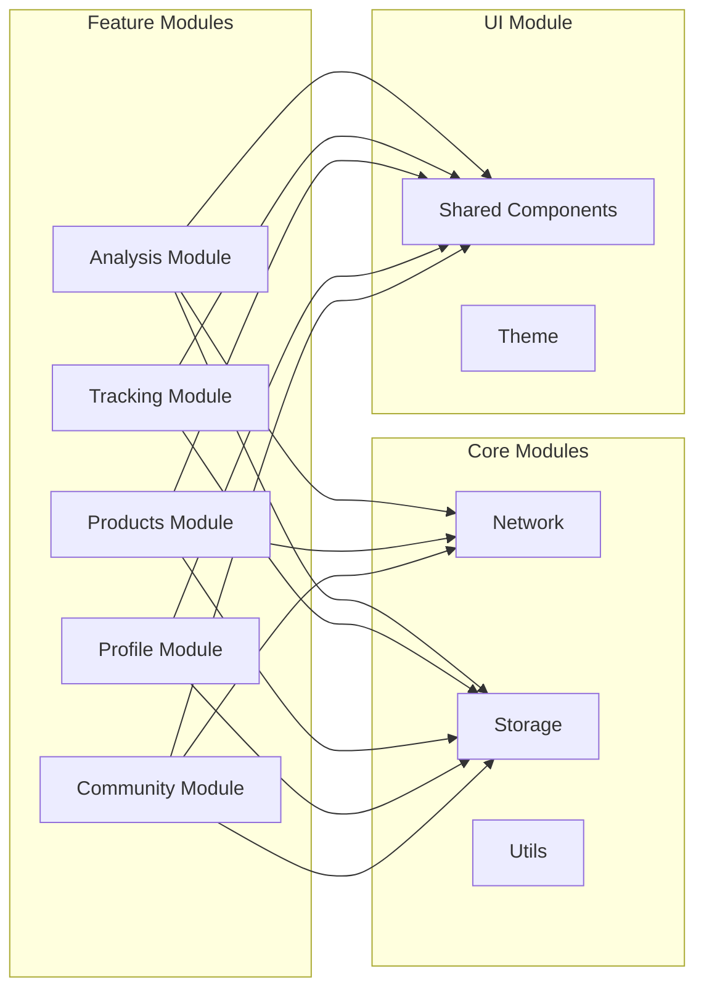
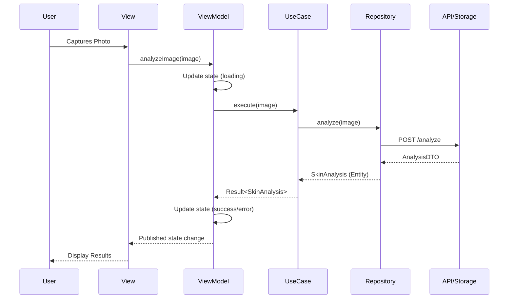
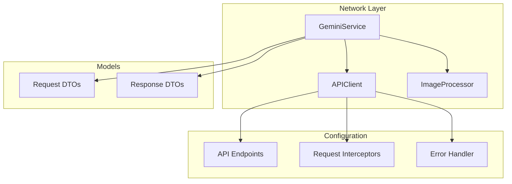
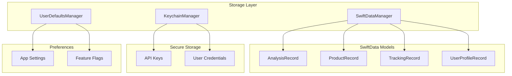
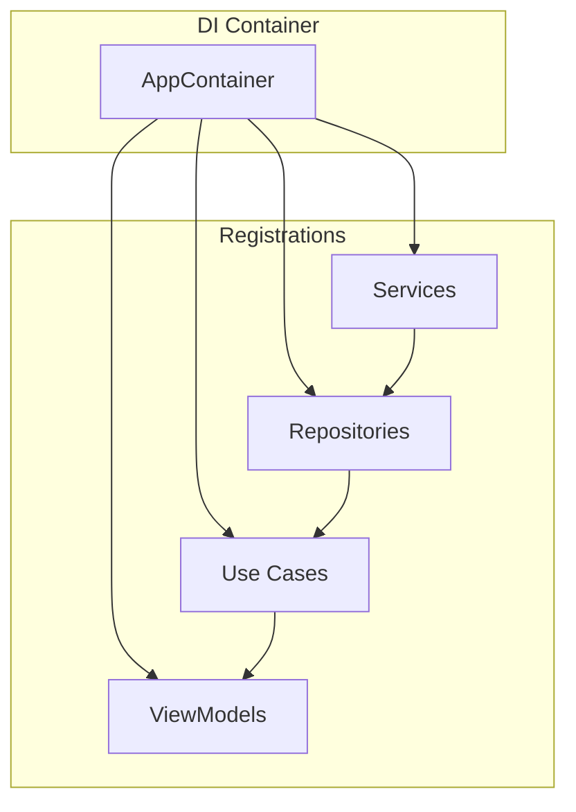
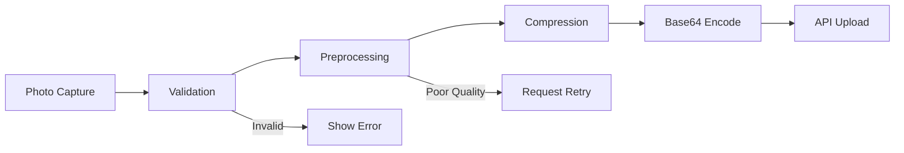
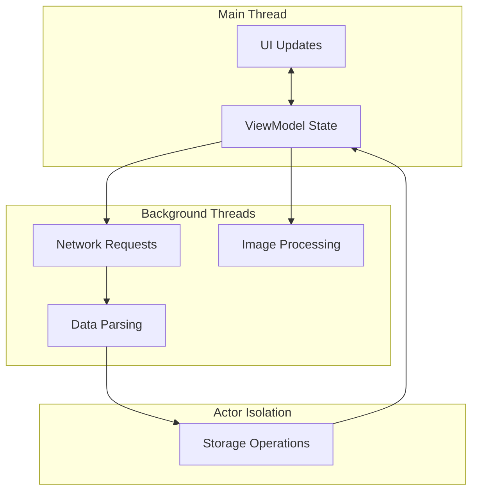

# SkinLab Architecture

## System Overview

SkinLab is an AI-powered skin analysis and skincare recommendation iOS application built with SwiftUI and following MVVM + Clean Architecture principles.



## MVVM + Clean Architecture Layers

### Presentation Layer
- **Views**: SwiftUI views responsible for UI rendering
- **ViewModels**: Handle presentation logic, state management, and user interactions

### Domain Layer
- **Use Cases**: Business logic encapsulation
- **Entities**: Core business models
- **Protocols**: Repository interfaces for dependency inversion

### Data Layer
- **Repositories**: Concrete implementations of domain protocols
- **Data Sources**: Remote and local data source implementations
- **Mappers**: DTO to Entity conversions

## Feature Modules Structure



### Module Breakdown

| Module | Description | Key Components |
|--------|-------------|----------------|
| **Analysis** | AI skin analysis | CameraView, AnalysisViewModel, GeminiService |
| **Tracking** | 28-day effect tracking | TrackingView, TrackingViewModel, ProgressCharts |
| **Products** | Product database & scanner | ProductListView, IngredientScanner, ProductRepository |
| **Profile** | User profile & settings | ProfileView, SkinFingerprint, SettingsView |
| **Community** | Social features | CommunityFeed, SkinTwinMatcher |

## Data Flow



## Network Layer

### Gemini Vision API Integration



### API Client Architecture

```swift
// Protocol-based design for testability
protocol APIClientProtocol {
    func request<T: Decodable>(_ endpoint: Endpoint) async throws -> T
}

// Endpoint configuration
enum GeminiEndpoint: Endpoint {
    case analyzeImage(Data)
    case generateContent(String)
    
    var path: String { ... }
    var method: HTTPMethod { ... }
    var body: Data? { ... }
}
```

### Error Handling

| Error Type | Description | Recovery Action |
|------------|-------------|-----------------|
| `NetworkError.noConnection` | No internet | Show offline state |
| `NetworkError.timeout` | Request timeout | Retry with backoff |
| `NetworkError.serverError` | 5xx response | Retry or show error |
| `AnalysisError.invalidImage` | Bad image quality | Request new photo |
| `AnalysisError.parseError` | Response parsing failed | Log and show generic error |

## Storage Layer



### SwiftData Schema

```swift
@Model
class AnalysisRecord {
    @Attribute(.unique) var id: UUID
    var skinType: String
    var skinAge: Int
    var overallScore: Int
    var issuesJSON: Data  // Encoded IssueScores
    var regionsJSON: Data // Encoded RegionScores
    var recommendations: [String]
    var analyzedAt: Date
    var imageHash: String?
    
    @Relationship(deleteRule: .cascade)
    var trackingRecords: [TrackingRecord]
}

@Model
class TrackingRecord {
    @Attribute(.unique) var id: UUID
    var date: Date
    var score: Int
    var notes: String?
    var photoHash: String?
    
    @Relationship(inverse: \AnalysisRecord.trackingRecords)
    var analysis: AnalysisRecord?
}
```

### Keychain Security

| Item | Purpose | Access Control |
|------|---------|----------------|
| `gemini-api-key` | Gemini API authentication | After first unlock |
| `user-token` | User session token | When unlocked |
| `encryption-key` | Local data encryption | When unlocked, this device only |

## Dependency Injection



### Container Setup

```swift
@MainActor
class AppContainer: ObservableObject {
    // Services
    lazy var apiClient: APIClientProtocol = APIClient()
    lazy var geminiService: GeminiServiceProtocol = GeminiService(client: apiClient)
    lazy var storageManager: StorageManagerProtocol = SwiftDataManager()
    lazy var keychainManager: KeychainManagerProtocol = KeychainManager()
    
    // Repositories
    lazy var analysisRepository: AnalysisRepositoryProtocol = 
        AnalysisRepository(gemini: geminiService, storage: storageManager)
    lazy var productRepository: ProductRepositoryProtocol = 
        ProductRepository(storage: storageManager)
    
    // Use Cases
    lazy var analyzeImageUseCase: AnalyzeImageUseCaseProtocol = 
        AnalyzeImageUseCase(repository: analysisRepository)
    
    // ViewModels
    func makeAnalysisViewModel() -> AnalysisViewModel {
        AnalysisViewModel(analyzeUseCase: analyzeImageUseCase)
    }
}
```

## Image Processing Pipeline



### Processing Steps

1. **Capture**: Camera or photo library selection
2. **Validation**: Check image dimensions, format, face detection
3. **Preprocessing**: Normalize lighting, crop to face region
4. **Compression**: JPEG compression to target size (<2MB)
5. **Encoding**: Base64 encoding for API transmission
6. **Upload**: Send to Gemini Vision API

## Threading Model



### Concurrency Guidelines

- Use `@MainActor` for all ViewModels
- Use Swift Concurrency (`async/await`) for all async operations
- Use `Task { }` for launching async work from sync contexts
- Use actors for shared mutable state (e.g., `StorageActor`)

## Performance Optimizations

| Area | Optimization | Impact |
|------|--------------|--------|
| **Images** | Lazy loading, caching, thumbnails | Memory, load time |
| **Network** | Request deduplication, retry with backoff | Reliability |
| **Storage** | Batch operations, background saves | UI responsiveness |
| **Lists** | Lazy stacks, prefetching | Scroll performance |
| **Analysis** | Result caching, incremental updates | API costs, speed |

## Security Considerations

1. **API Keys**: Stored in Keychain, never in code or UserDefaults
2. **User Photos**: Processed locally, sent via HTTPS, not stored on servers
3. **Local Data**: SwiftData with encrypted containers
4. **Network**: Certificate pinning, request signing
5. **Privacy**: Minimal data collection, user consent, data export/deletion
